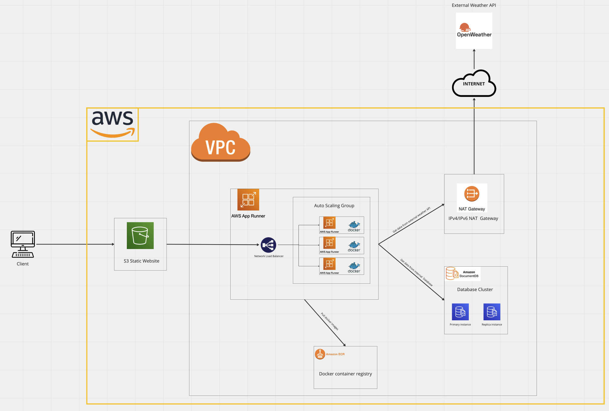

# Weather Alerting Service
## Authors
- Dawid Karoński 7390
- Piotr Bednarek 7393

## Project overview

This application lets users subscribe to **Weather Events** for a specific location and with a given time offset. The time offset may vary from 0 hours to 72 hours.
The app repeatedly requests weather forecast from _OpenWeather API_ and compares every trigger's condition with the forecasted value. In case the condition is fulfilled, all the alerts associated with the trigger are send over to recipients.

## Technologies

### The tech stack includes:

#### Backend (API)

- Typescript
- NestJS
- OpenWeather API

#### Frontend (UI) [See WeatherAlerting-Frontend repository](https://github.com/WeatherAlertingSystem/WeatherAlerting-Frontend)

- Typescript
- Angular

#### Database

- NoSQL
- Amazon AWS DocumentDB

#### Infrastructure [See WeatherAlerting-IaC repository](https://github.com/WeatherAlertingSystem/WeatherAlerting-IaC)

- Amazon AWS
- Pulumi (Infrastructure as Code)

## Scope of functionalities

- Creating user account
- Creating **Weather Triggers**
- Associating alert notifications with a Trigger
- Sending alerts via different channels (currently **email** only)

## Examples of use

1. I want to know if there will be freezing temperatures at my tomato farm, so I can react and turn or the heater by the greenhouse. I need some time to do that, so I better be notified a day before.
2. My capybara is allergic to high humidity, so I need a notifier if the humidity in my area is greater than, say 80%, so I can keep my capybara safe at home.

## Project status

MVP, production ready, infrastructure is up only when developing to cut costs

## Infrastructure

The application infrastructure has been developed in the AWS cloud. The main assumptions we followed:
1. Flexibility and scalability
2. High availability and reliability
3. Security
4. Ease of deployment

Our application has been built using Pulumi, a platform for infrastructure as code. Pulumi enables us to declaratively define and deploy application infrastructure in public cloud environments like AWS. With Pulumi, we can describe the entire application infrastructure in code, making it easier to manage and maintain infrastructure as part of the application lifecycle.
Pulumi supports multiple cloud platforms and programming languages, giving us the flexibility to choose the tool and environment that best suits our needs. We have choosen Python. Pulumi automatically creates and updates cloud resources based on our code, allowing for quick deployment of changes and maintaining consistency between the declared state and the actual infrastructure.

## CI/CD
Continuous Integration and Continuous Deployment (CI/CD) is build with GitHub Actions.
The project consists of a frontend and a backend application, each with its own deployment pipeline.

### Frontend Pipeline
The frontend pipeline is responsible for building the Angular application and deploying it to an S3 bucket on AWS. The pipeline is triggered on each push or pull request to the main branch.

Here are the main steps involved in the pipeline:

1. Build: The pipeline performs a build process for the Angular application, generating the necessary artifacts.
2. Tests: Automated tests are executed to ensure the application functions as expected.
3. Deployment: Upon successful tests, the build artifacts are deployed to an S3 bucket on AWS. This allows the frontend application to be accessed by users.

### Backend Pipeline
The backend pipeline focuses on building and deploying the NestJS backend application. Created Docker images are transfered to AWS ECR (Elastic Container Registry). Each new Docker images triggers automatic deployment in  AWS App Runner. Similar to the frontend pipeline, it is triggered by changes to the main branch.

The pipeline follows these steps:
1. Build Docker Image: The pipeline builds a Docker image containing the backend application and its dependencies.
2. Tests: Automated tests are performed to validate the functionality and integrity of the backend application.
3. Push to ECR: The Docker image is pushed to the AWS ECR, which acts as a repository for the image.
4. Deployment to App Runner: AWS App Runner automatically deploys the Docker image to a managed environment, making the backend application accessible to users.

## Use case diagram
The use case diagram for this app illustrates the various interactions and functionalities between the system and its actors, showcasing the different ways in which users and external systems can interact with the program. It provides a visual representation of the program's core features and helps to identify the actors involved and their specific use cases within the system.  

## Database

This app utilizes MongoDB, a NoSQL database, for data storage and management. MongoDB offers flexibility and scalability for structured and unstructured data. The database consists of three collections: admins, users, and weathertriggers. The admins collection stores information about application administrators, the users collection contains user data, and the weathertriggers collection stores data related to weather conditions and associated actions. 